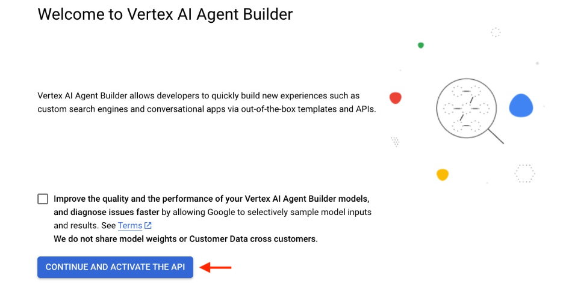
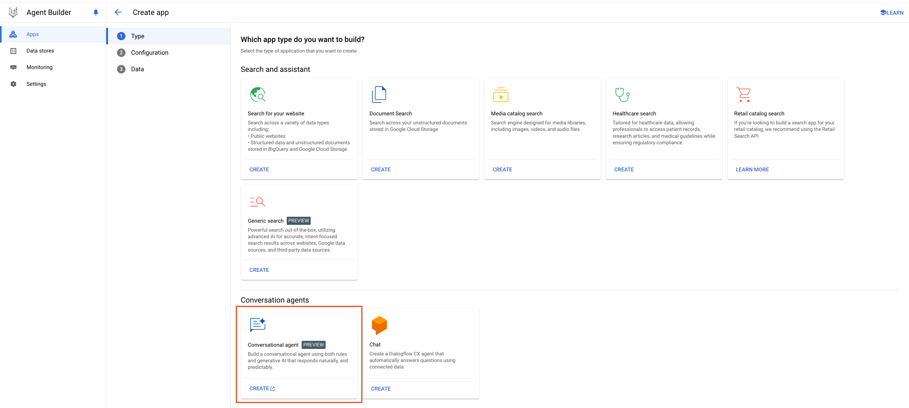
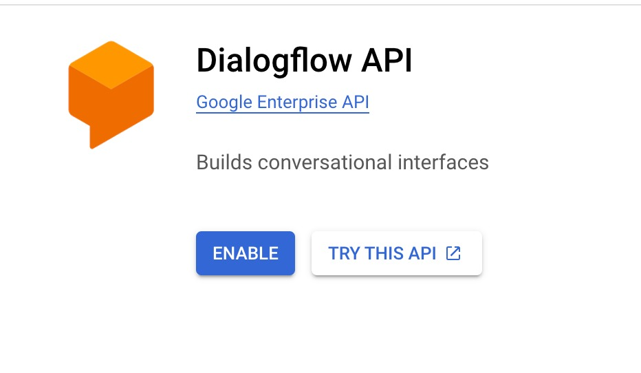
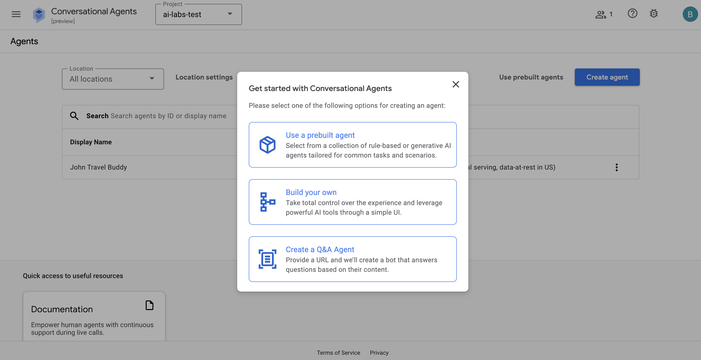
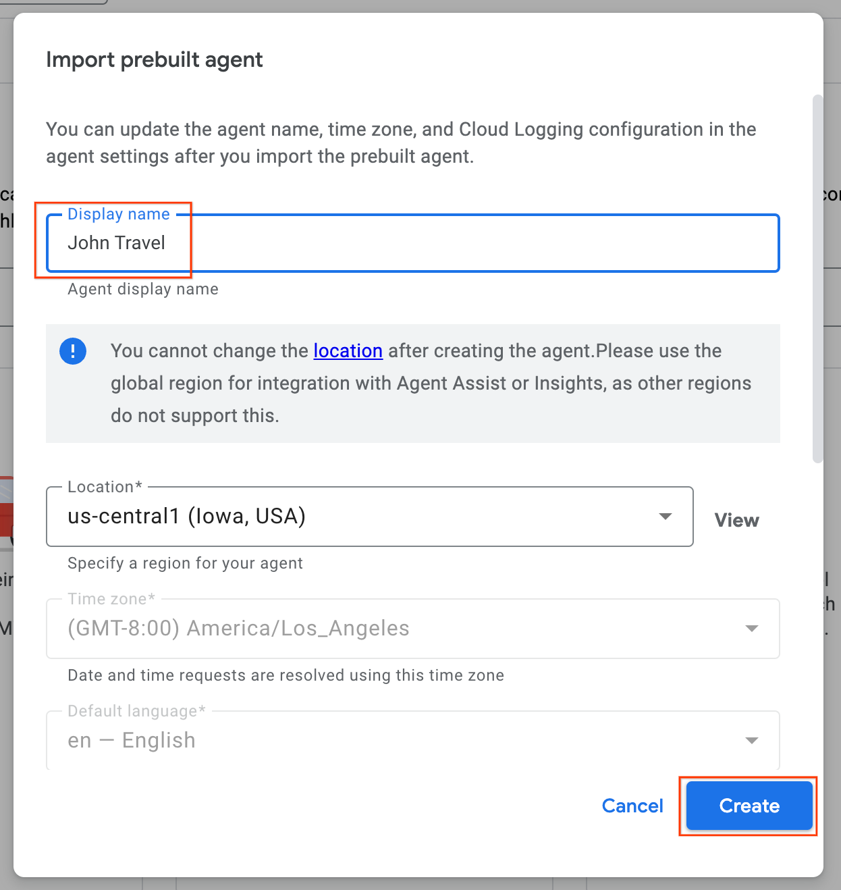
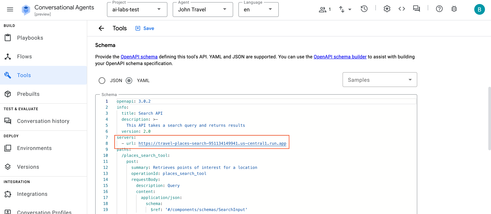

# Building AI Agents with Vertex AI Agent Builder

## Overview
In this lab, you'll learn how to build and deploy generative AI agents using Google Cloud's powerful tools and infrastructure. We'll cover the essential concepts and walk you through the initial steps to get your first agent up and running.

## Building an AI Agent with Vertex AI Agent Builder

With Vertex AI Agent Builder, AI Agents can be created in just a few steps. For today's lab, we will be importing a Pre-Built Agent so that you can see how it works and play around with it
### Step 1: Go to Vertex AI Agent Builder
- Open [Vertex AI Agent Builder](https://console.cloud.google.com/gen-app-builder) in a new tab.
- If you see the welcome page (see below), click on the **CONTINUE AND ACTIVATE THE API** button.
- If you don't see it, you can move onto Step 2.
    


### Step 2: Create an Agent
- You will be redirected to the **App Creation** page. 
- Click on the **CREATE A NEW APP** button.


- Select **Conversational Agent** on the next page



- You'll be brought to the **Conversational Agents** page
- If you see that Dialogflow API page (below), please click on **Enable** to enable the API. If not, please continue to next step

- Next, select **Use a prebuilt agent**



- If you get redirected to this page below, select **Use a prebuilt agent** again. (Ensure you have the right project selected at the top of the page)


- In the next page (shown below), select the **Travel** agent


- Click on **Import Agent**


- For the settings, give your Agent a name **(e.g. John Travel)**
- Leave everything else as default and click on **Create**


- Once created, click into the **Travel Steering** playbook
- Under **Instructions**, ensure that the phrases are replaced with **PLAYBOOK** (see red boxes in screenshot below)


- Next, in the left panel click on **Tools**
- Click into **places_search** tool.


- Scroll down to **Schema**
- Under Server URL, replace the URL with:
```bash
https://travel-places-search-951134149941.us-central1.run.app
```
- Once done, click **Save**


- Repeat this for the other tools - remember to always click **Save** after you edit!
  
| Tool Name         | URL |
| :---------------- | :------ |
| places_search     | https://travel-places-search-951134149941.us-central1.run.app    |
| hotel_booking     | https://travel-book-hotel-951134149941.us-central1.run.app       |
| hotel_search      | https://travel-places-search-951134149941.us-central1.run.app    |
| get_user_profile  | https://travel-get-user-profile-951134149941.us-central1.run.app |

- Once you're done, you are ready to test your travel agent! You can ask for recommendations, more information about certain places and also try to get it to book a hotel for you (of course it'll be a simulated booking, not an actual one!)
- Here are some as starters:
    - Beach vacation in Phuket
    - Hotels near the beach in Phuket
    - Hotels in Sentosa
    


